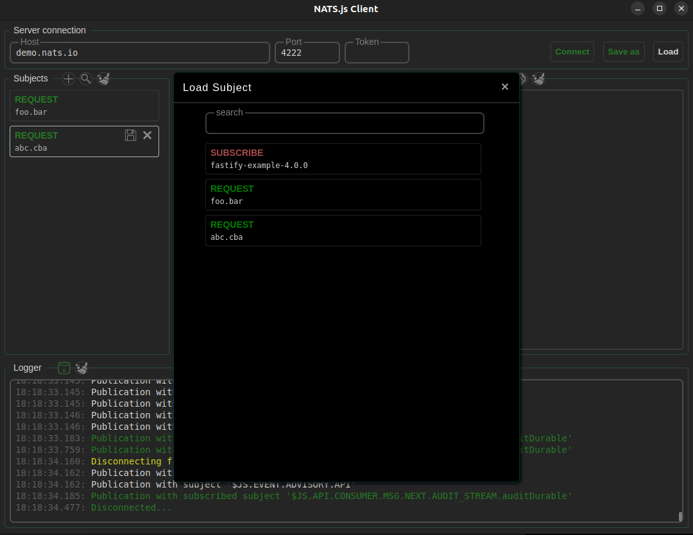

# nats-js-client

gui for nats.js client

repository: https://github.com/S-404/nats-client-gui

releases: https://github.com/S-404/nats-client-gui/releases

inspired by <a href="https://github.com/AlexxNB/natsman" target="_blank">natsman</a>

## scripts

### installation

    npm i

### build

    npm run build

use compiled image from  ``/release`` directory

### development

    npm run dev

## how to

### connection

connect to the server, you can save the latest state to storage

### add subject

at the ``Subjects`` block press the ``+ (add)`` button.\
this will create empty ``Subject`` 

or

press the ``🔍 (search)`` button\
this will open a modal window with stored subjects 

### publish message

put ``subject`` and ``payload`` and press one of the buttons corresponding to the Nats methods

result of ``request`` or ``subscribtion`` will be shown at ``messages`` block

### save subject

press ``save`` button on ``subject`` for saving it at storage

